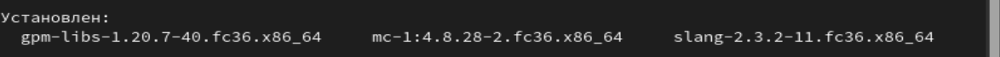
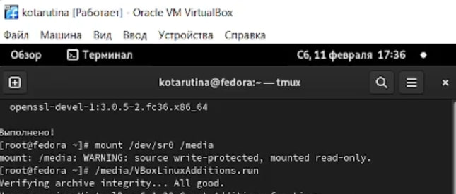

---
## Front matter
title: "Отчёт по лабораторной работе №1"
subtitle: "Простейший вариант"
author: "Тарутина Кристина Олеговна"

## Generic otions
lang: ru-RU
toc-title: "Содержание"

## Bibliography
bibliography: bib/cite.bib
csl: pandoc/csl/gost-r-7-0-5-2008-numeric.csl

## Pdf output format
toc: true # Table of contents
toc-depth: 2
lof: true # List of figures
lot: true # List of tables
fontsize: 12pt
linestretch: 1.5
papersize: a4
documentclass: scrreprt
## I18n polyglossia
polyglossia-lang:
  name: russian
  options:
	- spelling=modern
	- babelshorthands=true
polyglossia-otherlangs:
  name: english
## I18n babel
babel-lang: russian
babel-otherlangs: english
## Fonts
mainfont: PT Serif
romanfont: PT Serif
sansfont: PT Sans
monofont: PT Mono
mainfontoptions: Ligatures=TeX
romanfontoptions: Ligatures=TeX
sansfontoptions: Ligatures=TeX,Scale=MatchLowercase
monofontoptions: Scale=MatchLowercase,Scale=0.9
## Biblatex
biblatex: true
biblio-style: "gost-numeric"
biblatexoptions:
  - parentracker=true
  - backend=biber
  - hyperref=auto
  - language=auto
  - autolang=other*
  - citestyle=gost-numeric
## Pandoc-crossref LaTeX customization
figureTitle: "Рис."
tableTitle: "Таблица"
listingTitle: "Листинг"
lofTitle: "Список иллюстраций"
lotTitle: "Список таблиц"
lolTitle: "Листинги"
## Misc options
indent: true
header-includes:
  - \usepackage{indentfirst}
  - \usepackage{float} # keep figures where there are in the text
  - \floatplacement{figure}{H} # keep figures where there are in the text
---

# Цель работы

Целью данной работы является приобретение практических навыков установки операционной системы на виртуальную машину, настройки минимально необходимых для дальнейшей работы сервисов.

# Выполнение лабораторной работы

#Внимание:

Так как в данной лабораторной работе часть заданий совпадает с заданиями в лабораторной работе №1 прошлого семестра, в частности создание и настройка виртуальной машины и установка ОС, то на место этих заданий будет установлен старый отчёт. Потом он будет продолжаться новым

Шаг 1: Создание виртуальной машины

Создаю виртуальную машину, в качестве имени указывая свой логин из дисплейного класса(“kotarutina”), выбираю Linux Fedora как тип операционной системы(рис. @fig:001).

{#fig:001 width=70%}

Выделяю 2048 Мб оперативной памяти виртуальной машине(рис. @fig:002).

{#fig:002 width=70%}

Задаю конфигурацию жёсткого диска – загрузочный, VDI, динамический виртуальный диск (рис. @fig:003 - @fig:005).

{#fig:003 width=70%}

{#fig:004 width=70%}

{#fig:005 width=70%}

В качестве размера диска задаю 80 Гб, его расположение C:\Users\tarut\Virtualbox VMs\kotarutina\koratutina.vdi(рис. @fig:006).

{#fig:006 width=70%}

Шаг 2: Настройки 
В настройках виртуальной машины во вкладке Дисплей Экран увеличиваю доступный объем видеопамяти до 128 МБ (рис. @fig:007).
Добавляю новый привод оптических дисков и выбираю образ (рис. @fig:008).

{#fig:007 width=70%}

{#fig:008 width=70%}

Шаг 3: Запуск виртуальной машины и установка системы

Запускаю виртуальную машину на устрройстве
После этого в открывшемся окне выбираю вариант “Установить систему на жёсткий диск”((рис. @fig:009).

{#fig:009 width=70%}

Выбираю русский язык для проведение установки, в качестве языке для клавиатуры по умолчанию настраиваю английский, также добавляю русскую расскладку, корретирую часовой пояс(рис. @fig:010 - @fig:012).

{#fig:010 width=70%}

{#fig:011 width=70%}

{#fig:012 width=70%}

Проверяю наличие галочки на иконке диска(рис. @fig:013)
Завершаю процесс установки(рис. @fig:014)

{#fig:013 width=70%}

{#fig:014 width=70%}

Выключую виртуальную машину, удаляю образ из графы носители и перезапускаю машину вновь
Указываю полное имя ,а также имя пользователя(логин в дисплейном классе). Создаю пароль среднего уровня сложности и завершаю настройку виртуальной машины. (рис. @fig:015 - @fig:017)

{#fig:015 width=70%}

{#fig:016 width=70%}

{#fig:017 width=70%}

Дальше идёт часть с самостоятельной работой из старого отчёта

Запускаю Ос, установленную в VirtualBox
В меню приложений нахожу браузер и напускаю его(рис. @fig:018)
Также запускаю LibreOffice Writer(рис. @fig:019)

{#fig:018 width=70%}

{#fig:019 width=70%}

Запускаю терминал и устанавливаю Midninght Commander(рис. @fig:020 - @fig:021)
Проверяю его работу (рис. @fig:022)

{#fig:020 width=70%}

{#fig:021 width=70%}

{#fig:022 width=70%}

Устанавливаю git(рис. @fig:023)

{#fig:023 width=70%}

Устанавливаю nasm(рис. @fig:024 - @fig:025)

{#fig:024 width=70%}

{#fig:025 width=70%}

На этом старый отчёт из прошлого семестра закончены

Так как роль суперпользователя убирает из терминала надпись kotarutina (что мешает соглашению о наименовании), то я делаю снимок практически всего терминала, захватывая при этом kotarutina в самом верху окна. Иногда во избежании путаницы с командами я замазываю ненужные чёрным. 

Обновляю все пакеты (рис. @fig:026)

{#fig:026 width=70%}

Устанавливаю программу для удобства работы в консоли(рис. @fig:027)

{#fig:027 width=70%}

Устанавливаем программное обеспечение(рис. @fig:028)
Задаём необходимую конфигурацию в файле /etc/dnf/automatic.conf.
Запускаем таймер(рис. @fig:029)

{#fig:028 width=70%}

{#fig:029 width=70%}

В данном курсе мы не будем рассматривать работу с системой безопасности SELinux.
Поэтому отключим его.
В файле /etc/selinux/config заменяю значение

SELINUX=enforcing

на значение

SELINUX=permissive(рис. @fig:030)

Перезагружаю машину

{#fig:030 width=70%}

Запускаю терминальный мультиплексор tmux:
Переключаюсь на роль супер-пользователя:
Устанавливаю пакет DKMS
(рис. @fig:031)

{#fig:031 width=70%}

В меню виртуальной машины подключаю образ диска дополнений гостевой ОС.
Подмонтирую дис
Установливаю драйвера
Перегружаю виртуальную машину (рис. @fig:032)

{#fig:032 width=70%}

Запускаю терминальный мультиплексор tmux
Переключаюсь на роль супер-пользователя
Редактирую конфигурационный файл /etc/X11/xorg.conf.d/00-keyboard.conf
(рис. @fig:033 -  @fig:034)

{#fig:033 width=70%}

{#fig:034 width=70%}

pandoc и texlive у меня уже установлены(рис. @fig:035 -  @fig:036)

{#fig:035 width=70%}

{#fig:036 width=70%}

#Домашнее задание

В окне терминала анализирую последовательность загрузки системы, выполнив команду dmesg. (рис. @fig:037)

{#fig:037 width=70%}

Использую поиск с помощью grep(рис. @fig:038)

{#fig:038 width=70%}

Версия ядра Linux (Linux version).

Linux version 5.17.5-300.fc36.x86_64 

Частота процессора (Detected Mhz processor).

tsc: Detected 2095.986 MHz processor

Модель процессора (CPU0).

CPU0: AMD Ryzen 5 5500U with Radeon Graphics 

Объём доступной оперативной памяти (Memory available).

Memory: 1991264K/2096696K available 

Тип обнаруженного гипервизора (Hypervisor detected).

Hypervisor detected: KVM

Тип файловой системы корневого раздела.

EXT4-fs (sda1): mounted filesystem with ordered data mode. Quota mode: none.

Последовательность монтирования файловых систем.

# Выводы

приобретение практических навыков установки операционной системы на виртуальную машину, настройки минимально необходимых для дальнейшей работы сервисов прошло успешно

#Контрольные вопросы

Какую информацию содержит учётная запись пользователя?

User ID - логин;
Password – наличие пароля;
UID - идентификатор пользователя;
GID - идентификатор группы по умолчанию;
User Info – вспомогательная информация о пользователе (полное имя, контакты и т.д.)
Home Dir - начальный (он же домашний) каталог;
Shell - регистрационная оболочка, или shell.

Укажите команды терминала и приведите примеры:

для получения справки по команде; 

'какая-либо команда' --help(рис. @fig:039)

{#fig:039 width=70%}

для перемещения по файловой системе;

cd "директория"(рис. @fig:040)

{#fig:040 width=70%}

для просмотра содержимого каталога;

ls(рис. @fig:041)

{#fig:041 width=70%}

для определения объёма каталога;

du -sh(рис. @fig:042)

{#fig:042 width=70%}

для создания / удаления каталогов / файлов;

mkdir 'директория' (рис. @fig:043)

{#fig:043 width=70%}

touch 'файл' (рис. @fig:044)

{#fig:044 width=70%}

rm 'файл' (рис. @fig:045)

{#fig:045 width=70%}

для задания определённых прав на файл / каталог;

C помощью команды chmod. Есть три группы пользователей:
u - владелец файла;
g - группа файла;
o - другие пользователи
с помощью знаков + (добавить), - (убрать) и букв r(чтение), w(запись), x(выполнение)

для просмотра истории команд.

history

Что такое файловая система? Приведите примеры с краткой характеристикой.

Файловая система - это часть операционной системы, назначение
которой состоит в том, чтобы организовать эффективную работу с данными,
хранящимися во внешней памяти, и обеспечить пользователю удобный интерфейс
при работе с такими данными.

FS или Journaled File System была разработана в IBM для AIX UNIX и использовалась 
в качестве альтернативы для файловых систем ext. Сейчас она используется там, где 
необходима высокая стабильность и минимальное потребление ресурсов. При разработке 
файловой системы ставилась цель создать максимально эффективную файловую систему 
для многопроцессорных компьютеров. Также как и ext, это журналируемая файловая 
система, но в журнале хранятся только метаданные, что может привести к 
использованию старых версий файлов после сбоев.

Как посмотреть, какие файловые системы подмонтированы в ОС?

С помощью команды findmnt

Как удалить зависший процесс?

С помощью команды killal, зная имя процесса и команды kill зная PID процесса

# Список литературы{.unnumbered}

::: {#refs}
:::
