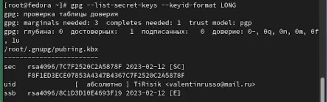
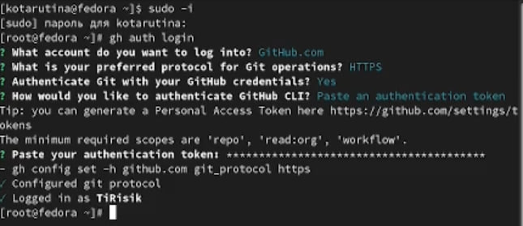

---
## Front matter
title: "Отчёт по лабораторной работе №2"
subtitle: "Простейший вариант"
author: "Тарутина Кристина Олеговна"

## Generic otions
lang: ru-RU
toc-title: "Содержание"

## Bibliography
bibliography: bib/cite.bib
csl: pandoc/csl/gost-r-7-0-5-2008-numeric.csl

## Pdf output format
toc: true # Table of contents
toc-depth: 2
lof: true # List of figures
lot: true # List of tables
fontsize: 12pt
linestretch: 1.5
papersize: a4
documentclass: scrreprt
## I18n polyglossia
polyglossia-lang:
  name: russian
  options:
	- spelling=modern
	- babelshorthands=true
polyglossia-otherlangs:
  name: english
## I18n babel
babel-lang: russian
babel-otherlangs: english
## Fonts
mainfont: PT Serif
romanfont: PT Serif
sansfont: PT Sans
monofont: PT Mono
mainfontoptions: Ligatures=TeX
romanfontoptions: Ligatures=TeX
sansfontoptions: Ligatures=TeX,Scale=MatchLowercase
monofontoptions: Scale=MatchLowercase,Scale=0.9
## Biblatex
biblatex: true
biblio-style: "gost-numeric"
biblatexoptions:
  - parentracker=true
  - backend=biber
  - hyperref=auto
  - language=auto
  - autolang=other*
  - citestyle=gost-numeric
## Pandoc-crossref LaTeX customization
figureTitle: "Рис."
tableTitle: "Таблица"
listingTitle: "Листинг"
lofTitle: "Список иллюстраций"
lotTitle: "Список таблиц"
lolTitle: "Листинги"
## Misc options
indent: true
header-includes:
  - \usepackage{indentfirst}
  - \usepackage{float} # keep figures where there are in the text
  - \floatplacement{figure}{H} # keep figures where there are in the text
---

# Цель работы

Изучить идеологию и применение средств контроля версий.
Освоить умения по работе с git.

# Выполнение лабораторной работы

#Внимание:

Так как в данной лабораторной работе часть заданий совпадает с заданиями в лабораторной работе №2 прошлого семестра, то на место этих заданий будет установлен старый отчёт. Потом он будет продолжаться новым

Шаг 1: Настройка github

Так как у меня уже была учётная запись на github, то этот шаг я пропустила

Шаг 2: Базовая настройка git

Делаю предварительную конфигурацию git. Открываю терминал и ввожу следующие команды, указав своё имя и email 
Настраиваю utf-8 в выводе сообщений git 
Задаю имя начальной ветки, Параметр autocrlf и параметр safecrlf  (рис. @fig:001).

{#fig:001 width=70%}

Шаг 3: Создание SSH ключа

Для последующей идентификации пользователя на сервере репозиториев генерирую пару ключей (приватный и открытый)(рис. @fig:002).

{#fig:002 width=70%}

Загружаю сгенерированный открытый ключ. Для этого захожу на сайт http://github.org/ под своей учётной записью и перехожу в меню Setting .
После этого выбираю в боковом меню SSH and GPG keys и нажимаю кнопку New SSH key .
Устанавливаю пакет xclip и копирую из локальной консоли ключ в буфер обмена (рис 3)
(рис. @fig:003) 

{#fig:003 width=70%}

Вставляю ключ в появившееся на сайте поле и указываем для ключа имя (здесь я, к сожалению, забыла сделать скриншот)

Шаг 4: Создание рабочего пространства и репозитория курса на основе шаблона
Создаю каталог для предмета «Архитектура компьютера» (рис. @fig:004)

{#fig:004 width=70%}

Перехожу на станицу репозитория с шаблоном курса, выбираю Use this
template. В открывшемся окне задаю имя репозитория study_2022–2023_arh- pc и создаю репозиторий (рис. @fig:005)

{#fig:005 width=70%}

В терминале перехожу в каталог курса, клонирую созданный репозиторий, ссылку для клонирования копирую на странице созданного репозитория(рис. @fig:006).

{#fig:006 width=70%}

Шаг 5: Настройка каталога курса 
Перехожу в каталог курса, Удаляю лишние файлы, Создаю необходимые каталоги (рис. @fig:007).
Отправляю файлы на сервер (рис. @fig:007 - рис. @fig:008).

{#fig:007 width=70%}

{#fig:008 width=70%}

Проверяю правильность создания иерархии рабочего пространства в локальном репозитории и на странице github. (рис. @fig:009 - @fig:010).

{#fig:009 width=70%}

{#fig:010 width=70%}

Далее идёт самостоятельная работп

1)	Создайте отчет по выполнению лабораторной работы в
соответствующем каталоге рабочего пространства (labs>lab03>report).
Создала отчёт в соответствующем каталоге (рис. @fig:011).

{#fig:011 width=70%}

2)	Скопируйте отчеты по выполнению предыдущих лабораторных работ в соответствующие каталоги созданного рабочего пространства.
Скопировала отчёты в соответствующие им каталоги (рис. @fig:012 - @fig:013).

{#fig:012 width=70%}

{#fig:013 width=70%}

3)	Загрузите файлы на github.

Загрузила файлы с помощью изображённых ниже команд(рис. @fig:014)

{#fig:014 width=70%}

На этом перенос старого отчёта закончен

Так как роль суперпользователя убирает из терминала надпись kotarutina (что мешает соглашению о наименовании), то я делаю снимок практически всего терминала, захватывая при этом kotarutina в самом верху окна. Иногда во избежании путаницы с командами я замазываю ненужные чёрным. 

Устанавливаю gh(рис. @fig:015)

{#fig:015 width=70%}

Генерирую ключ
Из предложенных опций выбираю:
тип RSA and RSA;
размер 4096;
выбеираю срок действия; значение по умолчанию — 0 (срок действия не истекает никогда).
Ввожу личную информацию по запросу(рис. @fig:016)

{#fig:016 width=70%}

Вывожу список ключей и копирую отпечаток приватного ключа (рис. @fig:017)

{#fig:017 width=70%}

Копирую сгенерированный PGP ключ в буфер обмена, используя введёный email, указываю Git применять его при подписи коммитов(рис. @fig:018)

{#fig:018 width=70%}

Авторизовываюсь (рис. @fig:019)

{#fig:019 width=70%}

Создаю шаблон рабочего пространства(рис. @fig:020 - @fig:021)
 
{#fig:020 width=70%}

{#fig:021 width=70%}

Перехожу в каталог курса, удаляю лишние файлы, создаю необходимые каталоги(рис. @fig:022)

{#fig:022 width=70%}

Отправляю файлы на сервер(рис. @fig:023)

{#fig:023 width=70%}

# Выводы

Изучение идеологии и применение средств контроля версий;освоение умения по работе с git прошло успешно

#Контрольные вопросы

Что такое системы контроля версий (VCS) и для решения каких задач они предназначаются?

Система управления версиями позволяет хранить несколько версий одного и того же документа, 
при необходимости возвращаться к более ранним версиям, определять, 
кто и когда сделал то или иное изменение, и многое другое. Такие системы наиболее широко 
используются при разработке программного обеспечения для хранения исходных кодов разрабатываемой программы.

Объясните следующие понятия VCS и их отношения: хранилище, commit, история, рабочая копия.

Хранилище или репозитарий, —
место хранения всех версий и служебной информации
Рабочая копия  —
текущее состояние файлов проекта, основанное на версии
из хранилища (обычно на последней).
Коммит - создание новой версии кода

Что представляют собой и чем отличаются централизованные и децентрализованные VCS? Приведите примеры VCS каждого вида.

Централизованные - Клиент-серверная модель: один
центральный репозиторий, с которым
разработчики взаимодействуют по сети
Централизованные VCS: Примеры
• CVS- одна из первых систем второго
поколения (1986г.). Обладает множеством
недостатков и считается устаревшей.
• Subversion (SVN) – система второго
поколения, созданная для замены CVS.
Одна из самых распространенных систем
контроля версий.

Распределенные VCS - В отличие от централизованной модели,
может существовать несколько экземпляров
репозитория, которые время от времени
синхронизируются между собой.
Распределенные VCS: примеры
• Git- распределенная система управления
версиями, созданная Л. Торвальдсом для
управления разработкой ядра Linux.
• Mercurial- другая распределенная VCS.
Создана в 2005 году М. Макалом с
практически одновременно с началом
разработке git’а и с аналогичными целями.

Каковы основные задачи, решаемые инструментальным средством git?

У Git две основных задачи: первая — хранить информацию о всех изменениях 
в вашем коде, начиная с самой первой строчки, а вторая — обеспечение
 удобства командной работы над кодом.

Назовите и дайте краткую характеристику командам git.

Команда git add добавляет содержимое рабочего каталога в индекс (staging area) для последующего коммита.
Команда git status показывает состояния файлов в рабочем каталоге и индексе: какие файлы изменены, но не 
добавлены в индекс; какие ожидают коммита в индексе. Вдобавок к этому выводятся подсказки о том, как изменить состояние файлов.
Команда git diff используется для вычисления разницы между любыми двумя Git деревьями.
Команда git commit берёт все данные, добавленные в индекс с помощью git add, и 
сохраняет их коммит во внутренней базе данных, а затем сдвигает указатель текущей ветки на этот коммит.
Команда git reset, как можно догадаться из названия, используется в основном для отмены изменений. 
Команда git rm используется в Git для удаления файлов из индекса и рабочей копии.
Команда git mv — это всего лишь удобный способ переместить файл, а затем выполнить git add для нового файла и git rm для старого.
Команда git clean используется для удаления мусора из рабочего каталога. Это могут быть результаты сборки проекта или файлы конфликтов слияний.

Что такое и зачем могут быть нужны ветви (branches)?

Ветка (англ. branch) — это последовательность коммитов,
в которой ведётся параллельная разработка какого-либо 
функционала. Основная ветка– master Ветки в GIT.
Ветки нужны, чтобы несколько программистов могли вести 
работу над одним и тем же проектом или даже файлом 
одновременно, при этом не мешая друг другу. Кроме того, 
ветки используются для тестирования экспериментальных 
функций: чтобы не повредить основному проекту, 
создается новая ветка специально для экспериментов.

Как и зачем можно игнорировать некоторые файлы при commit?

Игнорируемые файлы отслеживаются в специальном файле .gitignore,
 который регистрируется в корневом каталоге репозитория.
 В Git нет специальной команды для указания игнорируемых
 файлов: вместо этого необходимо вручную отредактировать
 файл .gitignore, чтобы указать в нем новые файлы, которые должны быть проигнорированы

Игнорировать файлы можно при их конфликте с чем-либо

# Список литературы{.unnumbered}

::: {#refs}
:::
