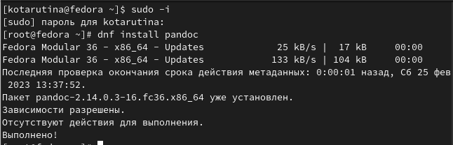

---
## Front matter
lang: ru-RU
title: Лабораторная работа №3
subtitle: Markdown.
author:
  - Тарутина К.О.
institute:
  - Российский университет дружбы народов, Москва, Россия
date: 25 февраля 2023

## i18n babel
babel-lang: russian
babel-otherlangs: english

## Formatting pdf
toc: false
toc-title: Содержание
slide_level: 2
aspectratio: 169
section-titles: true
theme: metropolis
header-includes:
 - \metroset{progressbar=frametitle,sectionpage=progressbar,numbering=fraction}
 - '\makeatletter'
 - '\beamer@ignorenonframefalse'
 - '\makeatother'
---

# Информация

## Докладчик

:::::::::::::: {.columns align=center}
::: {.column width="70%"}

  * Тарутина Кристина Олеговна
  * студент факультета физико-математических и естественных наук
  * Российский университет дружбы народов
  * [tarutina.k04@mail.ru](mailto:tarutina.k04@mail.ru)
  * <https://github.com/TiRisik>

:::

::::::::::::::

# Вводная часть

## Актуальность

Markdown -важный инструмент для оформления текстовых документов, позволяющий не использовать тяжёлые в некоторых ситуациях текстовые редакторы

## Объект и предмет исследования

- Markdown

## Цели и задачи

- Научиться оформлять отчёты с помощью легковесного языка разметки Markdown

## Материалы и методы

- Markdown
- Pandoc
- Texlive

# Работа с Markdown

## Установка ПО

## Перенос отчёта в формат Markdown

- Изучение базовых сведений о Markdown
- Перенос фотографий в необходимую папку
- Оформление согласно госту

# Результаты

- Отчёт в Формате Markdown

