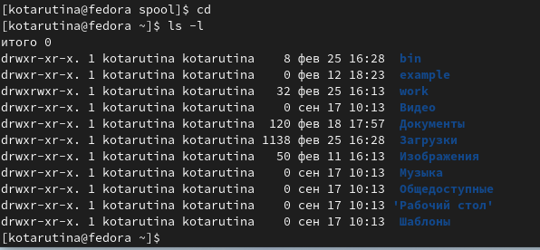

---
## Front matter
lang: ru-RU
title: Лабораторная работа №4
subtitle: .
author:
  - Тарутина К.О.
institute:
  - Российский университет дружбы народов, Москва, Россия
date: 4 Марта 2023

## i18n babel
babel-lang: russian
babel-otherlangs: english

## Formatting pdf
toc: false
toc-title: Содержание
slide_level: 2
aspectratio: 169
section-titles: true
theme: metropolis
header-includes:
 - \metroset{progressbar=frametitle,sectionpage=progressbar,numbering=fraction}
 - '\makeatletter'
 - '\beamer@ignorenonframefalse'
 - '\makeatother'
---

# Информация

## Докладчик

:::::::::::::: {.columns align=center}
::: {.column width="70%"}

  * Тарутина Кристина Олеговна
  * студент факультета физико-математических и естественных наук
  * Российский университет дружбы народов
  * [tarutina.k04@mail.ru](mailto:tarutina.k04@mail.ru)

:::
::::::::::::::

# Вводная часть

## Актуальность

- Важно уметь взаимодействовать с интерсфейсом на уровне строки
- Необходимо меть это делать быстро и затрачивать минимум усилий

## Объект и предмет исследования

- Командная строка
- Linux

## Цели и задачи

- Приобретение практических навыков взаимодействия пользователя с системой посредством командной строки.

# Работа с командной строкой

## Команда ls

##  Команда man ls

## Команда hirtory

## Команда mkdir и rm

## Команда man mkdir

# Результаты

## Вывод

- Получено умение пользоваться базовыми командами командной строки

:::

