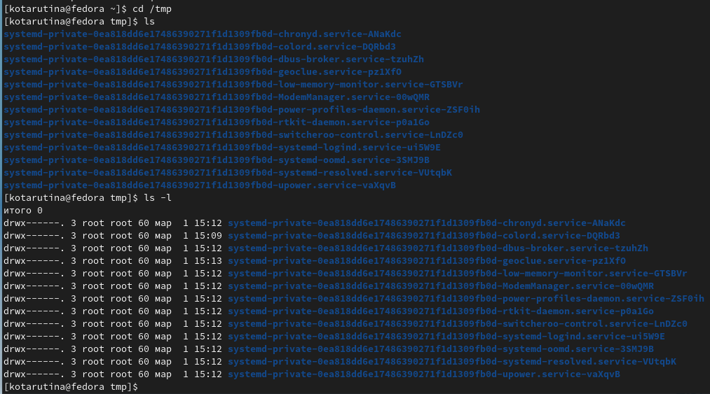

---
## Front matter
title: "Отчёт по лабораторной работе №4"
subtitle: "Основы интерфейса взаимодействия
пользователя с системой Unix на уровне командной строки"
author: "Тарутина Кристина Олеговна"

## Generic otions
lang: ru-RU
toc-title: "Содержание"

## Bibliography
bibliography: bib/cite.bib
csl: pandoc/csl/gost-r-7-0-5-2008-numeric.csl

## Pdf output format
toc: true # Table of contents
toc-depth: 2
lof: true # List of figures
lot: true # List of tables
fontsize: 12pt
linestretch: 1.5
papersize: a4
documentclass: scrreprt
## I18n polyglossia
polyglossia-lang:
  name: russian
  options:
	- spelling=modern
	- babelshorthands=true
polyglossia-otherlangs:
  name: english
## I18n babel
babel-lang: russian
babel-otherlangs: english
## Fonts
mainfont: PT Serif
romanfont: PT Serif
sansfont: PT Sans
monofont: PT Mono
mainfontoptions: Ligatures=TeX
romanfontoptions: Ligatures=TeX
sansfontoptions: Ligatures=TeX,Scale=MatchLowercase
monofontoptions: Scale=MatchLowercase,Scale=0.9
## Biblatex
biblatex: true
biblio-style: "gost-numeric"
biblatexoptions:
  - parentracker=true
  - backend=biber
  - hyperref=auto
  - language=auto
  - autolang=other*
  - citestyle=gost-numeric
## Pandoc-crossref LaTeX customization
figureTitle: "Рис."
tableTitle: "Таблица"
listingTitle: "Листинг"
lofTitle: "Список иллюстраций"
lotTitle: "Список таблиц"
lolTitle: "Листинги"
## Misc options
indent: true
header-includes:
  - \usepackage{indentfirst}
  - \usepackage{float} # keep figures where there are in the text
  - \floatplacement{figure}{H} # keep figures where there are in the text
---

# Цель работы

Приобретение практических навыков взаимодействия пользователя с системой посредством командной строки.

# Выполнение лабораторной работы

Определяю полное имя домашнего каталога с помощью команды pwd(рис. @fig:001).

{#fig:001 width=70%}

Перехожу в каталог /tmp. Вывожу на экран содержимое каталога /tmp. (рис. @fig:002).
В первом случае я использую просто команду ls, во втором же случае я использую ls -l, опция l позволяет вывести подробную информацию о файлах и каталогов, в то время как без этой опции команда выводит только названия файлов и каталогов, содержащихся в дирректории

{#fig:002 width=70%}

Перехожу в каталог /var/spool и с помощью команды ls просматриваю находящиеся внутри каталоги и файлы. Среди них нет каталога с именем cron(рис. @fig:003).

{#fig:003 width=70%}

Перехожу в домашнюю директория и с помощью команды ls просматриваю находящиеся там файлы и подкатологи. Добавив опцию l узнаю, что владельцем данных подкаталогов и файлов является пользователь kotarutina(рис. @fig:004).

{#fig:004 width=70%}

В домашнем каталоге создаю новый каталог с именем newdir.
В каталоге ~/newdir создаю новый каталог с именем morefun.(рис. @fig:005).

{#fig:005 width=70%}

В домашнем каталоге создаю одной командой три новых каталога с именами
letters, memos, misk. Затем удаляю эти каталоги одной командой(рис. @fig:006).

{#fig:006 width=70%}

Пробую удалить ранее созданный каталог ~/newdir командой rm. С помощью команды ls проверяю был ли каталог удалён. Каталог был успешно удалён, следовательно действие 3.5 по удалению подкаталога из данного каталога не представляется возможным(рис. @fig:007).

{#fig:007 width=70%}

С помощью команды man определяю, какую опцию команды ls нужно использовать для просмотра содержимое не только указанного каталога, но и подкаталогов, входящих в него (рис. @fig:008 - @fig:009).

R - опция команды ls, которую нужно использовать для просмотра содержимое не только указанного каталога, но и подкаталогов,
входящих в него.

С помощью команды man определяю набор опций команды ls, позволяющий отсортировать по времени последнего изменения выводимый список содержимого каталога с развёрнутым описанием файлов. (рис. @fig:008 - @fig:009)

-lt - набор опций команды ls, позволяющий отсортировать по времени последнего изменения выводимый список содержимого каталога с развёрнутым описанием файлов

{#fig:008 width=70%}

{#fig:009 width=70%}

Использую команду man для просмотра описания следующих команд: cd, pwd, mkdir,
rmdir, rm. (рис. @fig:010 - @fig:015).

{#fig:010 width=70%}

{#fig:011 width=70%}

{#fig:012 width=70%}

{#fig:013 width=70%}

{#fig:014 width=70%}

{#fig:015 width=70%}

(рис. @fig:016).

Используя информацию, полученную при помощи команды history, выполняю модификацию и исполнение нескольких команд из буфера команд.

{#fig:016 width=70%}

1. Что такое командная строка?

Командная строка – компонент Windows, не имеющий графического интерфейса, но позволяющий выполнять ряд команд в консольном режиме.

2. При помощи какой команды можно определить абсолютный путь текущего каталога?
Приведите пример.

Используйте команду pwd, чтобы узнать путь к текущему рабочему каталогу (папке), в котором вы находитесь от корневого каталога. Команда вернёт абсолютный (полный) путь, который по сути является путём всех каталогов, начинающийся с косой черты (/). Примером абсолютного пути является /home/username/

4. Каким образом отобразить информацию о скрытых файлах? Приведите примеры.

Самый простой способ показать скрытые файлы в Linux - это использовать команду ls с опцией -a, что значит all.

5. При помощи каких команд можно удалить файл и каталог? Можно ли это сделать
одной и той же командой? Приведите примеры.

При помощи команды rm

6. Каким образом можно вывести информацию о последних выполненных пользователем командах?

При помощи команды history

7. Как воспользоваться историей команд для их модифицированного выполнения? Приведите примеры.

Можно модифицировать команду из выведенного на экран списка при помощи следующей конструкции:

!<номер_команды>:s/<что_меняем>/<на_что_меняем>

8. Приведите примеры запуска нескольких команд в одной строке.

cd work; ls

9. Дайте определение и приведите примера символов экранирования.

Экранирование символов — замена в тексте управляющих символов на соответствующие текстовые подстановки. Один из видов управляющих последовательностей.

10. Охарактеризуйте вывод информации на экран после выполнения команды ls с опцией
l.

Выводить подробный список, в котором будет отображаться владелец, группа, дата создания, размер и другие параметры

11. Что такое относительный путь к файлу? Приведите примеры использования относительного и абсолютного пути при выполнении какой-либо команды.

Абсолютный (он же полный) путь — это когда мы указываем все диски и папки, в которые нужно зайти, чтобы добраться до нужного файла.

home/kotarutina/testfile/feathers

Относительный путь — это путь к файлу относительно текущего каталога. Текущий каталог — это тот, в котором запускается скрипт, программа или открывается страница в браузере.

image/image1.jpg

12. Как получить информацию об интересующей вас команде?

С помощью команды man

13. Какая клавиша или комбинация клавиш служит для автоматического дополнения
вводимых команд

Клавиша TAB — самая частая и основная в использовании среди всех горячих клавиш Linux. Данная клавиша поможет вам дополнить команду или путь к файлу или предложит варианты, если их несколько. Для использования данного функционала начните набирать команду и нажмите TAB после введения нескольких символов.

# Выводы

Приобретение практических навыков взаимодействия пользователя с системой посредством командной строки прошло успешно

