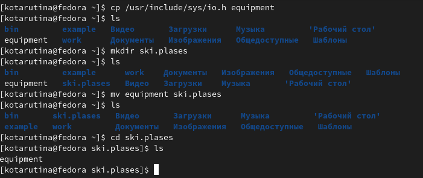
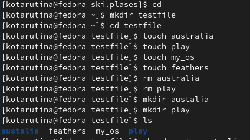
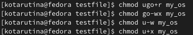
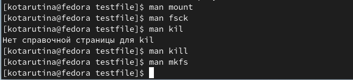

---
## Front matter
lang: ru-RU
title: Лабораторная работа №5
subtitle: Анализ файловой системы Linux. Команды для работы с файлами и каталогами
author:
  - Тарутина К.О.
institute:
  - Российский университет дружбы народов, Москва, Россия
date: 11 марта 2023

## i18n babel
babel-lang: russian
babel-otherlangs: english

## Formatting pdf
toc: false
toc-title: Содержание
slide_level: 2
aspectratio: 169
section-titles: true
theme: metropolis
header-includes:
 - \metroset{progressbar=frametitle,sectionpage=progressbar,numbering=fraction}
 - '\makeatletter'
 - '\beamer@ignorenonframefalse'
 - '\makeatother'
---

# Информация

## Докладчик

  * Тарутина Кристина Олеговна
  * студент факультета физико-математических и естественных наук
  * Российский университет дружбы народов
  * [tarutina.k04@mail.ru](mailto:tarutina.k04@mail.ru)

# Вводная часть

## Актуальность

- Важно уметь работать с файловой системой быстро и чётко

## Объект и предмет исследования

- Файловая система Linux

## Цели и задачи

- Ознакомление с файловой системой Linux, её структурой, именами и содержанием
каталогов.
- Приобретение практических навыков по применению команд для работы
с файлами и каталогами, по управлению процессами (и работами), по проверке использования диска и обслуживанию файловой системы

# Работа с файловой системой

## Копирование и перемещение, создание директорий

## Создание и удаление директорий, файлов

## Настройка прав доступа

## Команда man

# Результаты

## Практические навыки

- По применению команд для работы с файлами и каталогам
- По управлению процессами (и работами)
- По проверке использования диска и обслуживанию файловой системы

## Ознакомление

- С файловой системой Linux, её структурой, именами и содержанием
каталогов.

