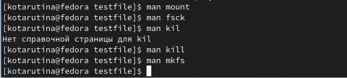

---
## Front matter
title: "Отчёт по лабораторной работе №5"
subtitle: "Анализ файловой системы Linux.
Команды для работы с файлами и каталогами"
author: "Тарутина Кристина Олеговна"

## Generic otions
lang: ru-RU
toc-title: "Содержание"

## Bibliography
bibliography: bib/cite.bib
csl: pandoc/csl/gost-r-7-0-5-2008-numeric.csl

## Pdf output format
toc: true # Table of contents
toc-depth: 2
lof: true # List of figures
lot: true # List of tables
fontsize: 12pt
linestretch: 1.5
papersize: a4
documentclass: scrreprt
## I18n polyglossia
polyglossia-lang:
  name: russian
  options:
	- spelling=modern
	- babelshorthands=true
polyglossia-otherlangs:
  name: english
## I18n babel
babel-lang: russian
babel-otherlangs: english
## Fonts
mainfont: PT Serif
romanfont: PT Serif
sansfont: PT Sans
monofont: PT Mono
mainfontoptions: Ligatures=TeX
romanfontoptions: Ligatures=TeX
sansfontoptions: Ligatures=TeX,Scale=MatchLowercase
monofontoptions: Scale=MatchLowercase,Scale=0.9
## Biblatex
biblatex: true
biblio-style: "gost-numeric"
biblatexoptions:
  - parentracker=true
  - backend=biber
  - hyperref=auto
  - language=auto
  - autolang=other*
  - citestyle=gost-numeric
## Pandoc-crossref LaTeX customization
figureTitle: "Рис."
tableTitle: "Таблица"
listingTitle: "Листинг"
lofTitle: "Список иллюстраций"
lotTitle: "Список таблиц"
lolTitle: "Листинги"
## Misc options
indent: true
header-includes:
  - \usepackage{indentfirst}
  - \usepackage{float} # keep figures where there are in the text
  - \floatplacement{figure}{H} # keep figures where there are in the text
---

# Цель работы

Ознакомление с файловой системой Linux, её структурой, именами и содержанием
каталогов. Приобретение практических навыков по применению команд для работы
с файлами и каталогами, по управлению процессами (и работами), по проверке использования диска и обслуживанию файловой системы.

# Выполнение лабораторной работы

Копируйте файл /usr/include/sys/io.h в домашний каталог и называю его
equipment. 
В домашнем каталоге создаю директорию ~/ski.plases.
Перемещаю файл equipment в каталог ~/ski.plases.(рис. @fig:001).

{#fig:001 width=70%}

Переименовываю файл ~/ski.plases/equipment в ~/ski.plases/equiplist(рис. @fig:002).

{#fig:002 width=70%}

Создаю в домашнем каталоге файл abc1 и копирую его в каталог
~/ski.plases, называю его equiplist2.(рис. @fig:003).

{#fig:003 width=70%}

Создаю каталог с именем equipment в каталоге ~/ski.plases.
Перемещаю файлы ~/ski.plases/equiplist и equiplist2 в каталог
~/ski.plases/equipment.(рис. @fig:004).

{#fig:004 width=70%}

Создайю и перемещаю каталог ~/newdir в каталог ~/ski.plases и называю
его plans(рис. @fig:005).

{#fig:005 width=70%}

Создаю файлы и каталоги необходимые для задания 3(рис. @fig:006).

{#fig:006 width=70%}

Присваиваю указанный в задание права директории austalia(рис. @fig:007).

{#fig:007 width=70%}

Присваиваю указанный в задание права директории play(рис. @fig:008).

{#fig:008 width=70%}

Присваиваю указанный в задание права файлу my_os(рис. @fig:009).

{#fig:009 width=70%}

(Присваиваю указанный в задание права файлу feathers. @fig:010).

{#fig:010 width=70%}

Проверяю правильно ли выполнила задание с помощью команды ls -l(рис. @fig:011).

{#fig:011 width=70%}

Пытаюсь просмотреть содержимое файла /etc/password с помощью команды cat. Компьютер такого файла не видит(рис. @fig:012).

{#fig:012 width=70%}

Копирую файл ~/feathers в файл ~/file.old.
Перемещаю файл ~/file.old в каталог ~/play.
Копирую каталог ~/play в каталог ~/fun.
Перемещаю каталог ~/fun в каталог ~/play и назовите его games.(рис. @fig:013).

{#fig:013 width=70%}

Лишаю владельца файла ~/feathers права на чтение.
Пытаюсь просмотреть файл ~/feathers командой cat. На экран выводят, что отказано в доступе
Пытаюсь скопировать файл ~/feathers. Снова отказано в доступе
Даю владельцу файла ~/feathers право на чтение.
(рис. @fig:014).

{#fig:014 width=70%}

Лишаю владельца каталога ~/play права на выполнение.
Перехожу в каталог ~/play. Отказано в доступе
Даю владельцу каталога ~/play право на выполнение(рис. @fig:015).

{#fig:015 width=70%}

Читаю man по командам mount, fsck, mkfs, kill(рис. @fig:016).

{#fig:016 width=70%}

# Выводы

Ознакомление с файловой системой Linux, её структурой, именами и содержанием
каталогов, приобретение практических навыков по применению команд для работы
с файлами и каталогами, по управлению процессами (и работами), по проверке использования диска и обслуживанию файловой системы прошло успешно

# Список литературы{.unnumbered}

::: {#refs}
:::
