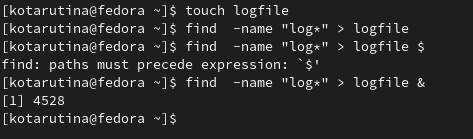
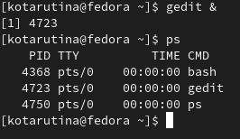
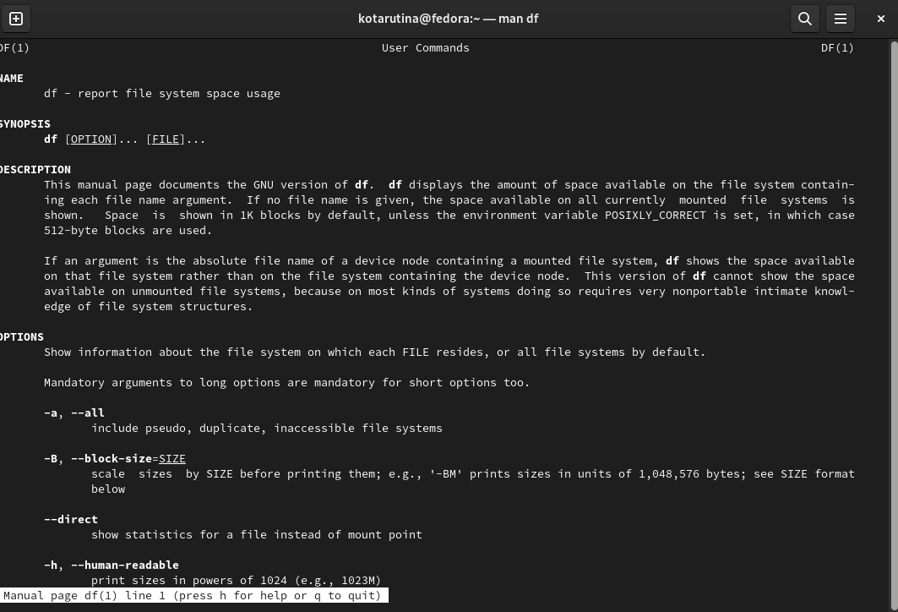

---
## Front matter
lang: ru-RU
title: Лабораторная работа №6
subtitle: Поиск файлов. Перенаправление ввода-вывода. Просмотр запущенных процессов
author:
  - Тарутина К.О.
institute:
  - Российский университет дружбы народов, Москва, Россия
date: 18 Марта 2023

## i18n babel
babel-lang: russian
babel-otherlangs: english

## Formatting pdf
toc: false
toc-title: Содержание
slide_level: 2
aspectratio: 169
section-titles: true
theme: metropolis
header-includes:
 - \metroset{progressbar=frametitle,sectionpage=progressbar,numbering=fraction}
 - '\makeatletter'
 - '\beamer@ignorenonframefalse'
 - '\makeatother'
---

# Информация

# Вводная часть

## Объект и предмет исследования

- Файловая система Linux

## Цели и задачи

- Ознакомление с инструментами поиска файлов и фильтрации текстовых данных
- Приобретение практических навыков: по управлению процессами (и заданиями), по
проверке использования диска и обслуживанию файловых систем.

# Работа с файловой системой и перенаправление ввода-вывода

## Поиск файла и запись найденного в файл

## Процесс в фоновом режиме

## Информация о команде df

# Результаты

## Вывод

- Ознакомились инструментами поиска файлов и фильтрации текстовых данных
- Приобрели практические навыков: по управлению процессами (и заданиями), по
проверке использования диска и обслуживанию файловых систем.

