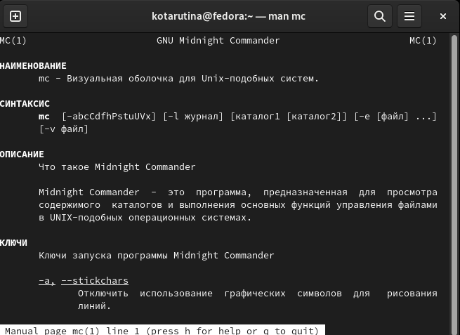
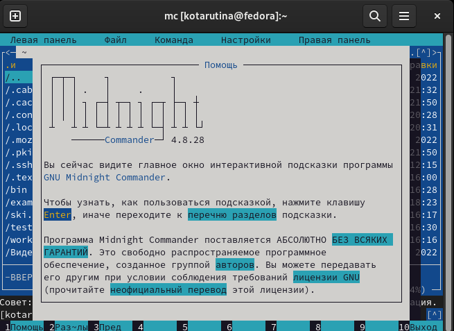
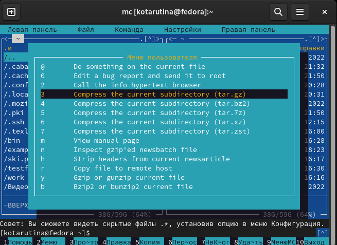
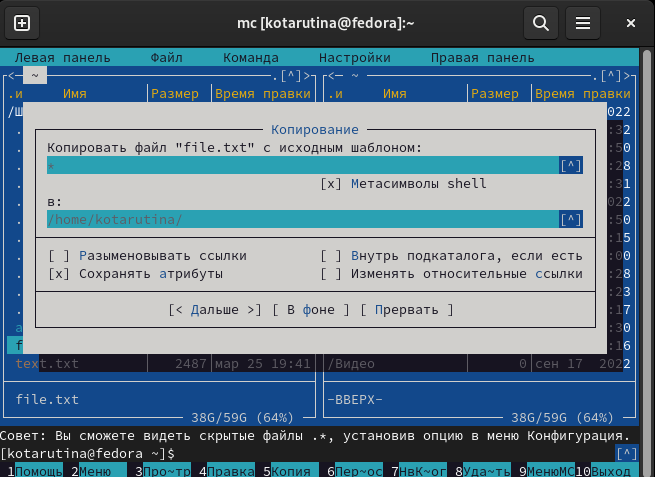
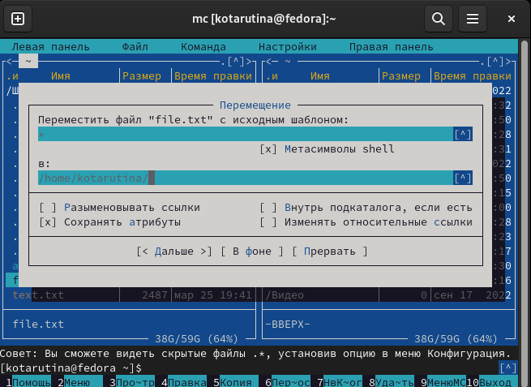
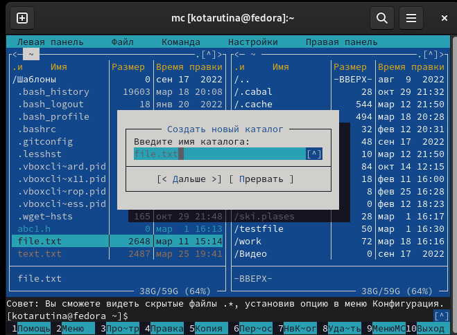

---
## Front matter
lang: ru-RU
title: Лабораторная работа № 7
subtitle: Командная оболочка Midnight Commander
author:
  - Тарутина К. О.
institute:
  - Российский университет дружбы народов, Москва, Россия
date: 25 Марта 2023 

## i18n babel
babel-lang: russian
babel-otherlangs: english

## Formatting pdf
toc: false
toc-title: Содержание
slide_level: 2
aspectratio: 169
section-titles: true
theme: metropolis
header-includes:
 - \metroset{progressbar=frametitle,sectionpage=progressbar,numbering=fraction}
 - '\makeatletter'
 - '\beamer@ignorenonframefalse'
 - '\makeatother'
---

# Вводная часть

## Объект и предмет исследования

- Операционная система Linux
- Midnight Commander

## Цели и задачи

Освоение основных возможностей командной оболочки Midnight Commander. Приобретение навыков практической работы по просмотру каталогов и файлов; манипуляций
с ними.

# Выполнение лабораторной работы

## Man mc

## Вызов контекстно-зависимой подсказки

## Вызов пользовательского меню с возможностью создания и/или дополнения дополнительных функций

## Копирование одного или нескольких файлов, отмеченных в первой (активной) панели, в каталог, отображаемый на второй панели

## Перенос одного или нескольких файлов, отмеченных в первой (активной) панели, в каталог, отображаемый на второй панели

## Создание подкаталога в каталоге, отображаемом в активной панели

# Результаты

## Вывод

- Освоены основные возможности командной оболочки Midnight Commander. 
- Приобретены навыки практической работы по просмотру каталогов и файлов; манипуляций с ними.

