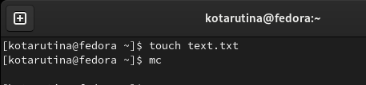

---
## Front matter
title: "Лабораторная работа № 7"
subtitle: "Командная оболочка Midnight Commander"
author: "Тарутина Кристина Олеговна"

## Generic otions
lang: ru-RU
toc-title: "Содержание"

## Bibliography
bibliography: bib/cite.bib
csl: pandoc/csl/gost-r-7-0-5-2008-numeric.csl

## Pdf output format
toc: true # Table of contents
toc-depth: 2
lof: true # List of figures
lot: true # List of tables
fontsize: 12pt
linestretch: 1.5
papersize: a4
documentclass: scrreprt
## I18n polyglossia
polyglossia-lang:
  name: russian
  options:
	- spelling=modern
	- babelshorthands=true
polyglossia-otherlangs:
  name: english
## I18n babel
babel-lang: russian
babel-otherlangs: english
## Fonts
mainfont: PT Serif
romanfont: PT Serif
sansfont: PT Sans
monofont: PT Mono
mainfontoptions: Ligatures=TeX
romanfontoptions: Ligatures=TeX
sansfontoptions: Ligatures=TeX,Scale=MatchLowercase
monofontoptions: Scale=MatchLowercase,Scale=0.9
## Biblatex
biblatex: true
biblio-style: "gost-numeric"
biblatexoptions:
  - parentracker=true
  - backend=biber
  - hyperref=auto
  - language=auto
  - autolang=other*
  - citestyle=gost-numeric
## Pandoc-crossref LaTeX customization
figureTitle: "Рис."
tableTitle: "Таблица"
listingTitle: "Листинг"
lofTitle: "Список иллюстраций"
lotTitle: "Список таблиц"
lolTitle: "Листинги"
## Misc options
indent: true
header-includes:
  - \usepackage{indentfirst}
  - \usepackage{float} # keep figures where there are in the text
  - \floatplacement{figure}{H} # keep figures where there are in the text
---

# Цель работы

Освоение основных возможностей командной оболочки Midnight Commander. Приобретение навыков практической работы по просмотру каталогов и файлов; манипуляций с ними

# Выполнение лабораторной работы

Изучаю информацию о mc, вызвав в командной строке man mc.(рис. @fig:001).

{#fig:001 width=70%}

Запускаю из командной строки mc, изучаю его структуру и меню.(рис. @fig:002).

{#fig:002 width=70%}

Выполняю несколько операций в mc, используя управляющие клавиши

Вызываю контекстно-зависимую подсказку с помощью F1(рис. @fig:003).

{#fig:003 width=70%}

Вызываю пользовательское меню с возможностью создания и/или дополнения дополнительных функций с помощью F2(рис. @fig:004).

{#fig:004 width=70%}

Просмотриваю содержимое файла, на который указывает подсветка в активной панели (без возможности редактирования) с помощью F3 (рис. @fig:005).

{#fig:005 width=70%}

Вызываю встроенный в mc редактор для изменения содержания файла,
на который указывает подсветка в активной панели с помощью F4(рис. @fig:006).

{#fig:006 width=70%}

Копирую один или несколько файлов, отмеченных в первой
(активной) панели, в каталог, отображаемый на второй панели с помощью F5(рис. @fig:007).

{#fig:007 width=70%}

Переношу один или нескольких файлов, отмеченных в первой (активной) панели, в каталог, отображаемый на второй панели с помощью F6(рис. @fig:008).

{#fig:008 width=70%}

Создаю подкаталог в каталоге, отображаемом в активной панели с помощью F7(рис. @fig:009).

{#fig:009 width=70%}

Создаю файл text.txt и открываю Midnight
Commander (рис. @fig:010).

{#fig:010 width=70%}

Открываю файл text.txt, вставляю туда произвольный текст
Удаляю строку с помощью ctrl+y 
Выделяю строку с помощью F3 и копирую с помощью F5 (рис. @fig:011 - @fig:012).

{#fig:011 width=70%}

{#fig:012 width=70%}

Сохраняю файл с помощью F2(рис. @fig:013).

{#fig:013 width=70%}

Отменяю предыдущее действие с помощью ctrl+u(рис. @fig:014).

{#fig:014 width=70%}

# Выводы

Освоение основных возможностей командной оболочки Midnight Commander. Приобретение навыков практической работы по просмотру каталогов и файлов; манипуляций с ними прошло успешно

# Список литературы{.unnumbered}

::: {#refs}
:::
