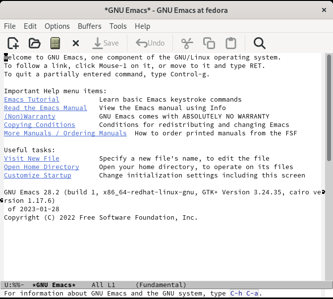
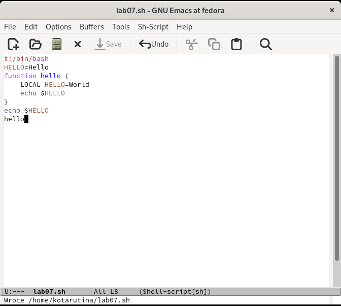
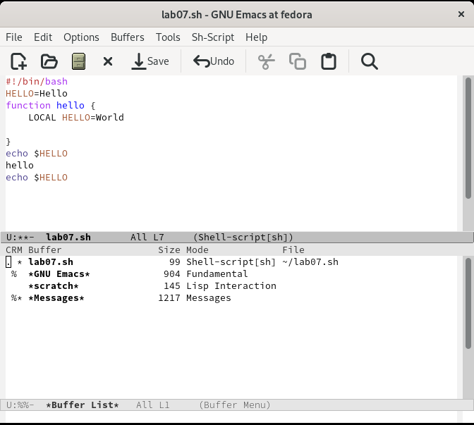
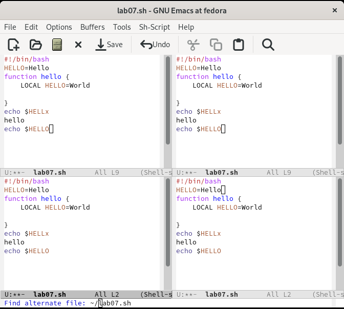

---
## Front matter
lang: ru-RU
title: Лабораторная работа №9
subtitle:  Текстовой редактор emacs
author:
  - Тарутина К.О.
institute:
  - Российский университет дружбы народов, Москва, Россия
date: 08 преля 2023

## i18n babel
babel-lang: russian
babel-otherlangs: english

## Formatting pdf
toc: false
toc-title: Содержание
slide_level: 2
aspectratio: 169
section-titles: true
theme: metropolis
header-includes:
 - \metroset{progressbar=frametitle,sectionpage=progressbar,numbering=fraction}
 - '\makeatletter'
 - '\beamer@ignorenonframefalse'
 - '\makeatother'
---

# Вводная часть

## Объект и предмет исследования

- Текстовой редактор emacs
- Операционная система Linux 

## Цели и задачи

- Познакомиться с операционной системой Linux. 
- Получить практические навыки работы с редактором Emacs.

# Ход лабораторной работы

## Emacs

## Сохранение

## Буфер

## Четыре окна

# Результаты

## РЕЗУЛЬТАТЫ

- Ознакомились с операционной системой Linux. 
- Получитли практические навыки работы с редактором Emacs.

