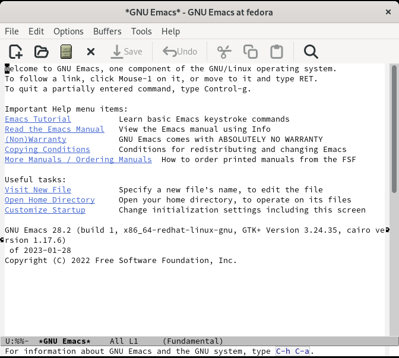
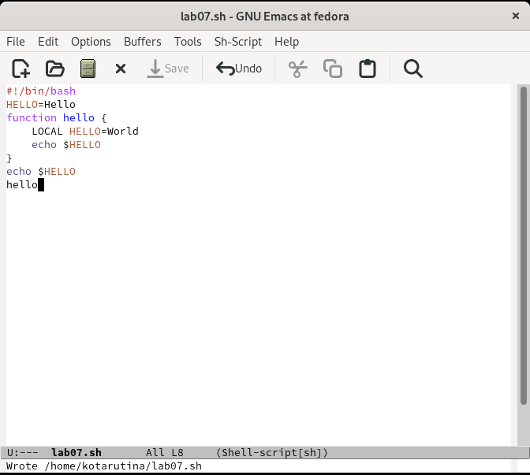
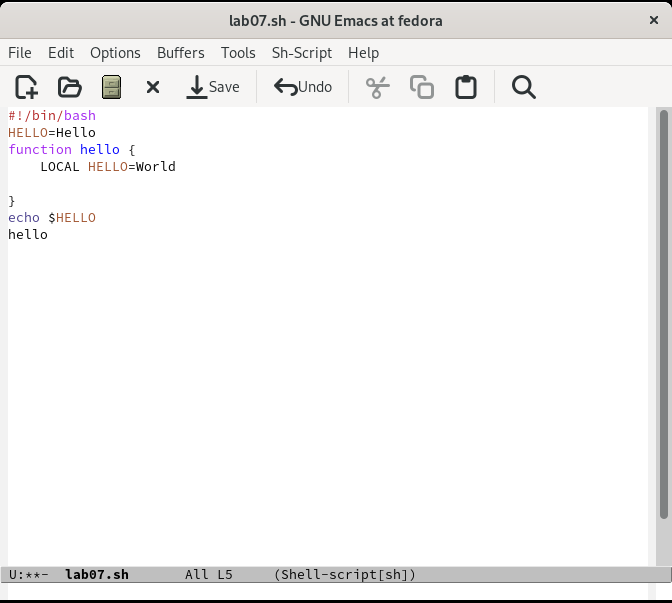
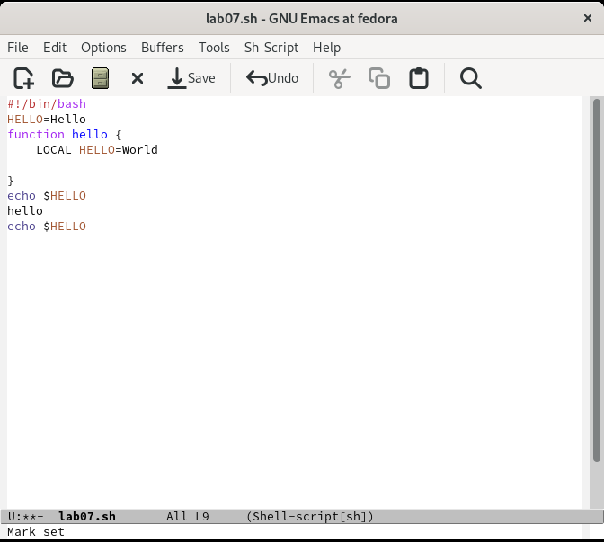
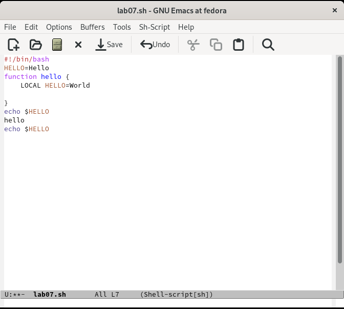
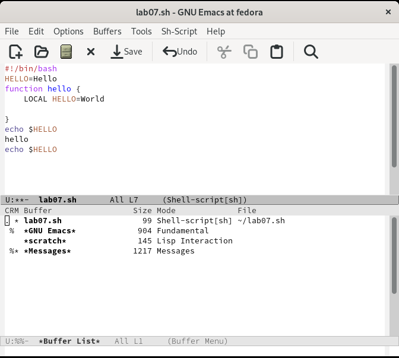
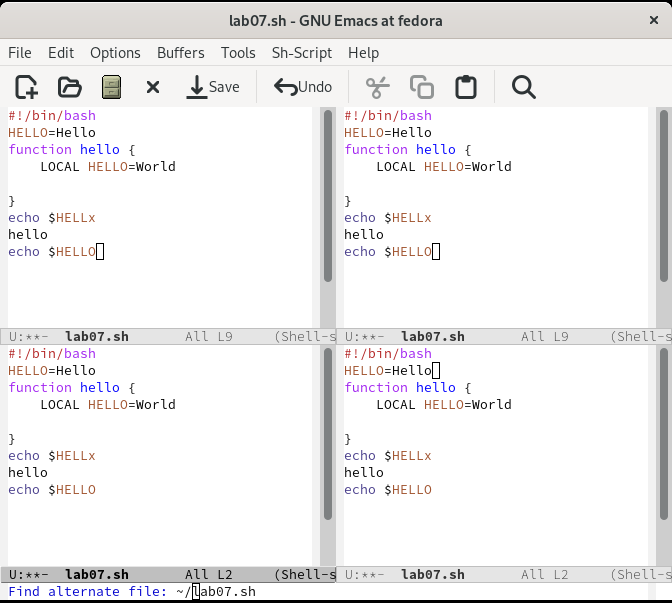

---
## Front matter
title: "Лабораторная работа №9"
subtitle: "Текстовой редактор emacs"
author: "Тарутина К.0"

## Generic otions
lang: ru-RU
toc-title: "Содержание"

## Bibliography
bibliography: bib/cite.bib
csl: pandoc/csl/gost-r-7-0-5-2008-numeric.csl

## Pdf output format
toc: true # Table of contents
toc-depth: 2
lof: true # List of figures
lot: true # List of tables
fontsize: 12pt
linestretch: 1.5
papersize: a4
documentclass: scrreprt
## I18n polyglossia
polyglossia-lang:
  name: russian
  options:
	- spelling=modern
	- babelshorthands=true
polyglossia-otherlangs:
  name: english
## I18n babel
babel-lang: russian
babel-otherlangs: english
## Fonts
mainfont: PT Serif
romanfont: PT Serif
sansfont: PT Sans
monofont: PT Mono
mainfontoptions: Ligatures=TeX
romanfontoptions: Ligatures=TeX
sansfontoptions: Ligatures=TeX,Scale=MatchLowercase
monofontoptions: Scale=MatchLowercase,Scale=0.9
## Biblatex
biblatex: true
biblio-style: "gost-numeric"
biblatexoptions:
  - parentracker=true
  - backend=biber
  - hyperref=auto
  - language=auto
  - autolang=other*
  - citestyle=gost-numeric
## Pandoc-crossref LaTeX customization
figureTitle: "Рис."
tableTitle: "Таблица"
listingTitle: "Листинг"
lofTitle: "Список иллюстраций"
lotTitle: "Список таблиц"
lolTitle: "Листинги"
## Misc options
indent: true
header-includes:
  - \usepackage{indentfirst}
  - \usepackage{float} # keep figures where there are in the text
  - \floatplacement{figure}{H} # keep figures where there are in the text
---

# Цель работы

Познакомиться с операционной системой Linux. Получить практические навыки работы с редактором Emacs.

# Выполнение лабораторной работы

1. Открываю emacs. (рис. @fig:001).
{#fig:001 width=70%}
2. Создаю файл lab07.sh с помощью комбинации Ctrl-x Ctrl-f (C-x C-f) и набираю текст
Сохраняю файл с помощью комбинации Ctrl-x Ctrl-s (C-x C-s) (рис. @fig:002). 
{#fig:002 width=70%}
5. Проделываю с текстом стандартные процедуры редактирования, каждое действие осуществляю комбинацией клавиш.
5.1. Вырезать одной командой целую строку (С-k).
5.2. Вставить эту строку в конец файла (C-y).
5.3. Выделить область текста (C-space).
5.4. Скопировать область в буфер обмена (M-w).
5.5. Вставить область в конец файла.
5.6. Вновь выделить эту область и на этот раз вырезать её (C-w).
5.7. Отмените последнее действие (C-/).
(рис. @fig:003 - @fig:004). 
{#fig:003 width=70%}
{#fig:004 width=70%}
6.Использую команды по перемещению курсора. (рис. @fig:005).
6.1. Переместите курсор в начало строки (C-a).
6.2. Переместите курсор в конец строки (C-e).
6.3. Переместите курсор в начало буфера (M-<).
6.4. Переместите курсор в конец буфера (M->).
{#fig:005 width=70%}
7. Управление буферами. (рис. @fig:006).
7.1. Вывести список активных буферов на экран (C-x C-b)
7.2. Переместитесь во вновь открытое окно (C-x) o со списком открытых буферов
и переключитесь на другой буфер.
7.3. Закройте это окно (C-x 0).
7.4. Теперь вновь переключайтесь между буферами, но уже без вывода их списка на
экран (C-x b).
{#fig:006 width=70%}
8. Делю фрейм на 4 части (рис. @fig:007).
{#fig:007 width=70%}

# Выводы

Ознакомление с операционной системой Linux и получение практических навыков работы с редактором Emacs прошло успешно

# Список литературы{.unnumbered}

::: {#refs}
:::
