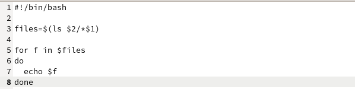

---
## Front matter
lang: ru-RU
title: Лабораторная работа №10
subtitle: Программирование в командном процессоре ОС UNIX. Командные файлы
author:
  - Тарутина К.О.
institute:
  - Российский университет дружбы народов, Москва, Россия
date: 15 апреля 2024

## i18n babel
babel-lang: russian
babel-otherlangs: english

## Formatting pdf
toc: false
toc-title: Содержание
slide_level: 2
aspectratio: 169
section-titles: true
theme: metropolis
header-includes:
 - \metroset{progressbar=frametitle,sectionpage=progressbar,numbering=fraction}
 - '\makeatletter'
 - '\beamer@ignorenonframefalse'
 - '\makeatother'
---

# Вводная часть

## Цели и задачи

- Изучить основы программирования в оболочке ОС UNIX/Linux
- Научиться писать небольшие командные файлы.

# Ход лабораторной работы

## Текст первой программы 

## Текст второй программы 

## Текст третьей программы 

## Текст четвёртой программы 

# Результаты

## Вывод

- Изучили основы программирования в оболочке ОС UNIX/Linux
- Научились писать небольшие командные файлы.

