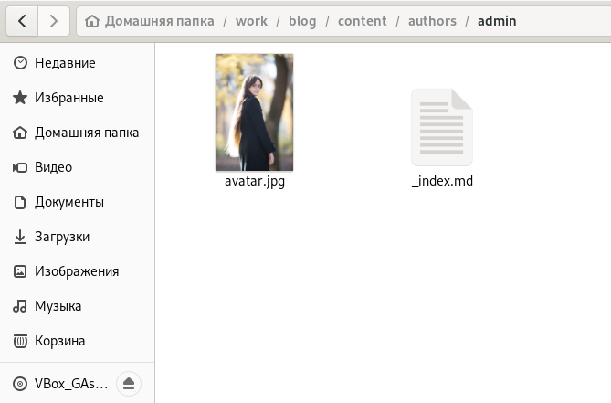
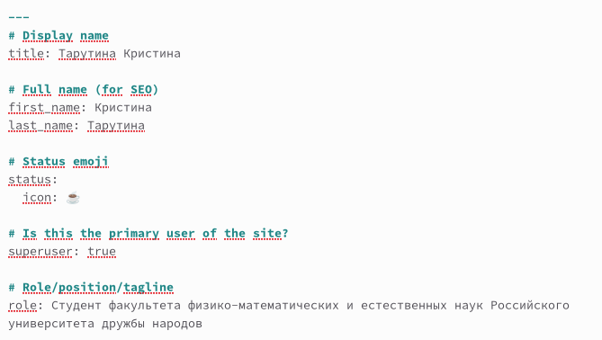
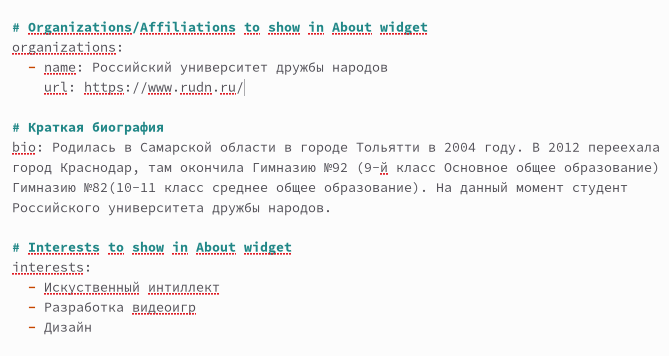
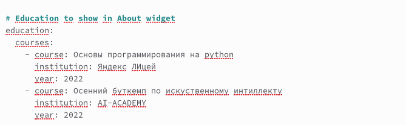
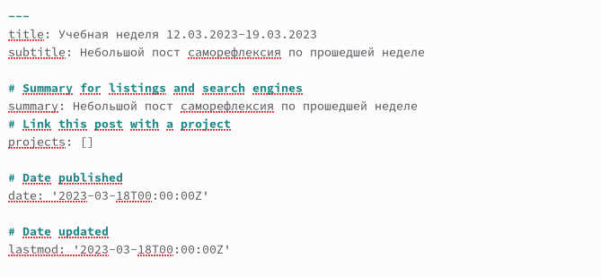
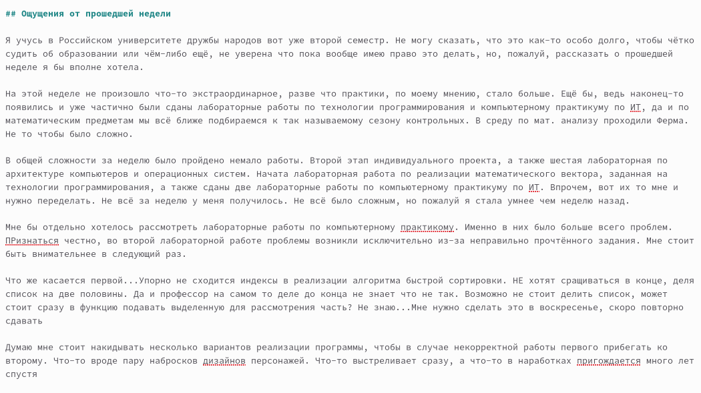

---
## Front matter
lang: ru-RU
title: Второй этап реализации индивидуального проекта
subtitle: Простейший шаблон
author:
  - Тарутина К.О.
institute:
  - Российский университет дружбы народов, Москва, Россия
date: 18 марта 2023

## i18n babel
babel-lang: russian
babel-otherlangs: english

## Formatting pdf
toc: false
toc-title: Содержание
slide_level: 2
aspectratio: 169
section-titles: true
theme: metropolis
header-includes:
 - \metroset{progressbar=frametitle,sectionpage=progressbar,numbering=fraction}
 - '\makeatletter'
 - '\beamer@ignorenonframefalse'
 - '\makeatother'
---

# Вводная часть

## Объект и предмет исследования

- Шаблон Hugo

## Цели и задачи

- Научиться редактировать индивидуальный сайт

# Создание сайта

## Добавление аватара

## Изменение имени

## Добавление биографии

## Добавление образования

## Шапка поста о прошедшей неделе

## Текст поста

# Результаты

## Изменения в сайте

- Изменены фотография и имя владельца
- ДобавленЫ краткая биография, интересы и образование
- Добавлен пост о прошедшей неделе
