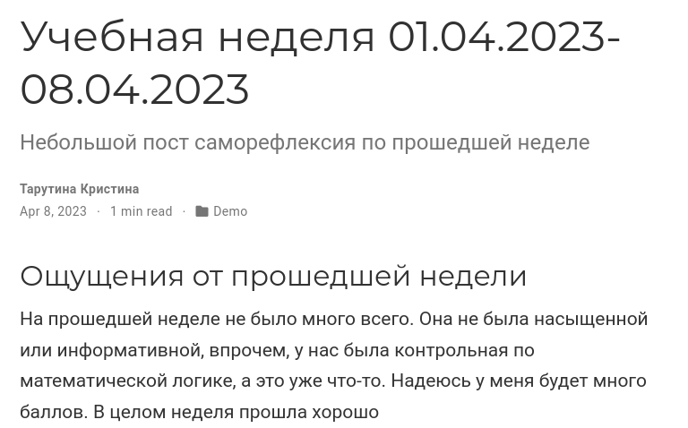

---
## Front matter
lang: ru-RU
title: Третий этап индивидуального проекта
subtitle: Простейший шаблон
author:
  - Тарутина К.О.
institute:
  - Российский университет дружбы народов, Москва, Россия
date: 08 апреля 2023

## i18n babel
babel-lang: russian
babel-otherlangs: english

## Formatting pdf
toc: false
toc-title: Содержание
slide_level: 2
aspectratio: 169
section-titles: true
theme: metropolis
header-includes:
 - \metroset{progressbar=frametitle,sectionpage=progressbar,numbering=fraction}
 - '\makeatletter'
 - '\beamer@ignorenonframefalse'
 - '\makeatother'
---

# Вводная часть

## Объект и предмет исследования

- Шаблон сайта научника

## Цели и задачи

- Добавить к сайту достижения.
- Сделать пост по прошедшей неделе.
- Добавить пост на тему Язык разметки Markdown.

# Ход выполнения

## Пост по неделе

## Пост на тему

# Результаты

## Вывод

- Успешно отредактировали сайт

